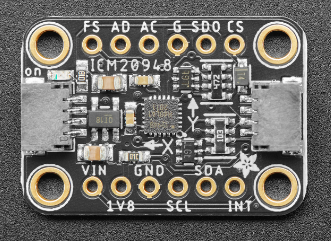

# ICM20948
- **Development framework** PlatformIO

## EVAL-Board used
[Adafruit TDK InvenSense ICM-20948 9-DoF IMU](https://learn.adafruit.com/adafruit-tdk-invensense-icm-20948-9-dof-imu)

## ESP32 DevKitC Pinout 

# Wiring Diagram 
Peripheral: SoftwareSPI

| ICM20948    | ESP32 DevKitC |
|-------------|---------------|
| VIN         | 3.3V          |
| GND         | GND           |
| SCL         | GP25          |
| SDA         | GP26          |
| SD0         | GP33          |
| CS          | GP32          |

