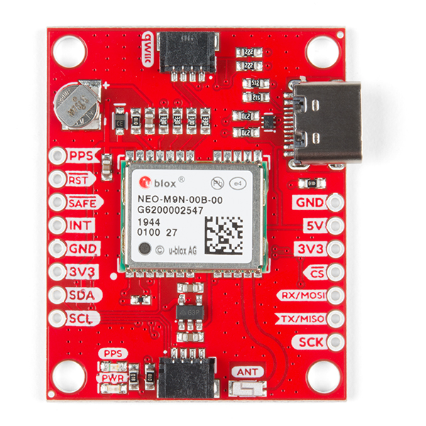

# NEO-9M
- **Development framework** PlatformIO

## EVAL-Board used
[SparkFun GPS Breakout - NEO-M9N, Chip Antenna (Qwiic)](https://learn.sparkfun.com/tutorials/sparkfun-gps-neo-m9n-hookup-guide?_gl=1*1a6pjwt*_ga*NzgzNDA0MDIzLjE2OTUzODU5NjY.*_ga_T369JS7J9N*MTY5OTYyNDU2OS4yMC4wLjE2OTk2MjQ1NjkuNjAuMC4w&_ga=2.162227708.1745289031.1699624570-783404023.1695385966)

## ESP32 DevKitC Pinout 

# Wiring Diagram 
| NEO-9M      | ESP32 DevKitC |
|-------------|---------------|
| 3V3         | 3.3V          |
| GND         | GND           |
| SDA         | GP21          |
| SCL         | GP22          |