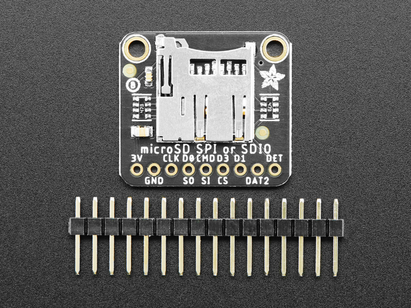

# SD over SDMMC Peripheral
There are two options when choosing to write to a SD card.          
- The first one is to use the SPI protocol.       
- The second one is to use the SDMMC peripheral. This is way faster than SPI because it uses more data lines.

Luckily, the ESP32 DevKitC has a SDMMC host 

## EVAL-Board used
[Adafruit MicroSD SPI or SDIO Card Breakout Board](https://learn.adafruit.com/adafruit-microsd-spi-sdio/overview)

## ESP32 DevKitC Pinout 

## Wiring Diagram 
| SD Card     | ESP32 DevKitC |
|-------------|---------------|
| 3V          | 3.3V          |
| GND         | GND           |
| CLK         | GP14          |
| S0/D0       | GP2           |
| S1/CMD      | GP15          |
| CS/D3       | GP13          |
| D1          | GP4           |
| DAT2        | GP12          |

## To Do
Check, whether pull ups are necessary
