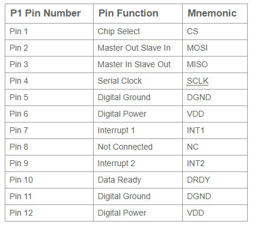

# ADXL355 
- **Development framework:** PlatformIO
## EVAL-Board used
[EVAL-ADXL355-PMDZ](https://www.analog.com/en/design-center/evaluation-hardware-and-software/evaluation-boards-kits/EVAL-ADXL355-PMDZ.html#eb-overview)

## Digital Interface (PMOD)

## ESP32 DevKitC Pinout 

## Wiring Diagram
| ADXL355 Pin | ESP32 DevKitC |
|-------------|---------------|
| GND         | GND           |
| VCC         | 3.3V          |
| MISO (Pin3) | GP19          |
| MOSI (Pin2) | GP23          |
| SCK  (Pin4) | GP18          |
| CS   (Pin1) | GP5           |