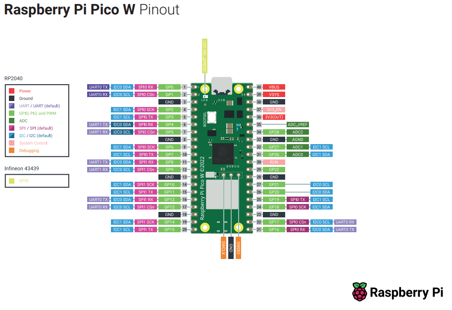

# Prototype 1
- **Development framework:** Micropython
### Components and their Peripherals
- Microcontroller: Raspberry Pi Pico
- ADXL345 via I2C0
- NEO6M via UART1
- SIM7080G via UART0
- SD via SPI1

## Wiring Diagram

| SD Card Pin | Raspberry Pi Pico |
|-------------|-------------------|
| GND         | GND               |
| VCC         | 3.3V              |
| MISO        | GP11              |
| MOSI        | GP12              |
| SCK         | GP10              |
| CS          | GP13              |

| ADXL345 Pin | Raspberry Pi Pico |
|-------------|-------------------|
| GND         | GND               |
| VCC         | 3.3V              |
| SDA         | GP20              |
| SCL         | GP21              |
| CS          | 3.3V (to use I2C mode)|
| SD0         | GND (sets I2C address to 0x53)|

| GPS NEO6M Pin | Raspberry Pi Pico |
|---------------|-------------------|
| GND           | GND               |
| VCC           | 3.3V              |
| RX            | GP4 (UART1 TX)    |
| TX            | GP5 (UART1 RX)    |

| LED Pin | Raspberry Pi Pico |
|---------|-------------------|
| +       | GP16              |
| -       | GND               |

| Button Pin | Raspberry Pi Pico |
|------------|-------------------|
| +          | GP17              |
| -          | GND               |

## Already working
- 

## To Do
- MQTT over NB-IoT

## More Ideas