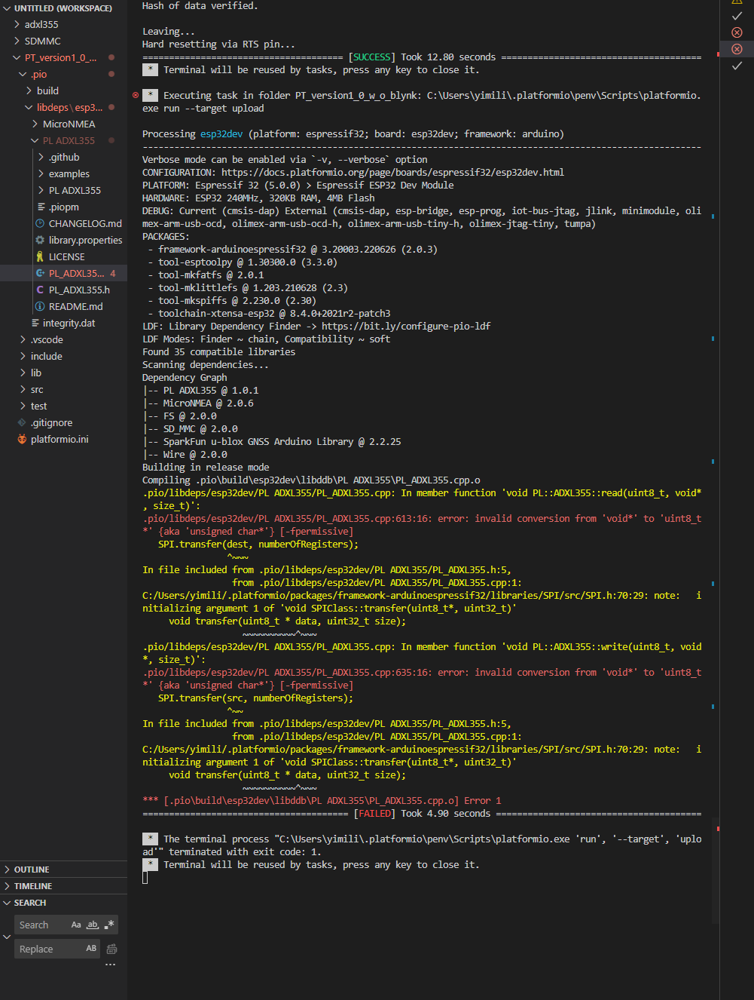

# Prototype 2
- **Development framework:** PlatformIO
### Components and their Peripherals
- Microcontroller: ESP32
- ADXL355 via SPI
- NEO9M via I2C
- SD via SDMMC
- ICM20948 via SoftwareSPI

## Wiring Diagram

| SD Card     | ESP32 DevKitC |
|-------------|---------------|
| 3V          | 3.3V          |
| GND         | GND           |
| CLK         | GP14          |
| S0/D0       | GP2           |
| S1/CMD      | GP15          |
| CS/D3       | GP13          |
| D1          | GP4           |
| DAT2        | GP12          |

| ADXL355 Pin | ESP32 DevKitC |
|-------------|---------------|
| GND         | GND           |
| VCC         | 3.3V          |
| MISO (Pin3) | GP19          |
| MOSI (Pin2) | GP23          |
| SCK  (Pin4) | GP18          |
| CS   (Pin1) | GP5           |

| NEO-9M      | ESP32 DevKitC |
|-------------|---------------|
| 3V3         | 3.3V          |
| GND         | GND           |
| SDA         | GP21          |
| SCL         | GP22          |

Peripheral: SoftwareSPI

| ICM20948    | ESP32 DevKitC |
|-------------|---------------|
| VIN         | 3.3V          |
| GND         | GND           |
| SCL         | GP25          |
| SDA         | GP26          |
| SD0         | GP33          |
| CS          | GP32          |

## How to use project
1. Install PlatformIO with Arduino IDE
2. Format the SD Card in FAT32 file format
3. Plug the usb cable into the ESP32 and the SD card into the SD card module
4. Upload the program, make sure that the Boot button is pressed down during the whole upload process
5. There can be an error message which looks like this: 

6. To solve this, delete the folder with the path `DMSP\prototype_2\PT_version1_0_w_o_blynk\.pio\libdeps\esp32dev\PL ADXL355` 
and copy the folder with the path 
`\DMSP\components\adxl355\.pio\libdeps\esp32dev\PL ADXL355`
into 
`DMSP\prototype_2\PT_version1_0_w_o_blynk\.pio\libdeps\esp32dev`

7. Upload the program again

The program is now flashed on the micrcontroller

8. Press the EN Button to start/restart the application

